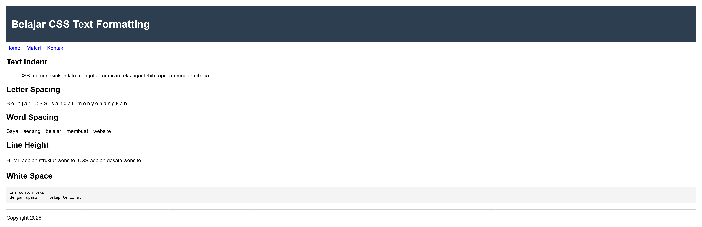
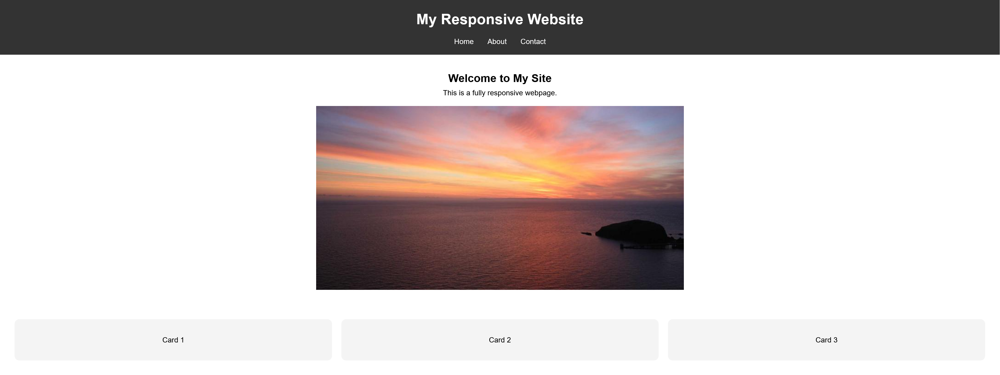
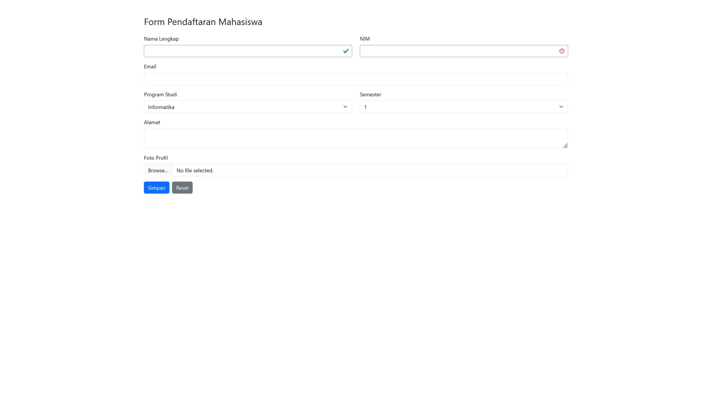
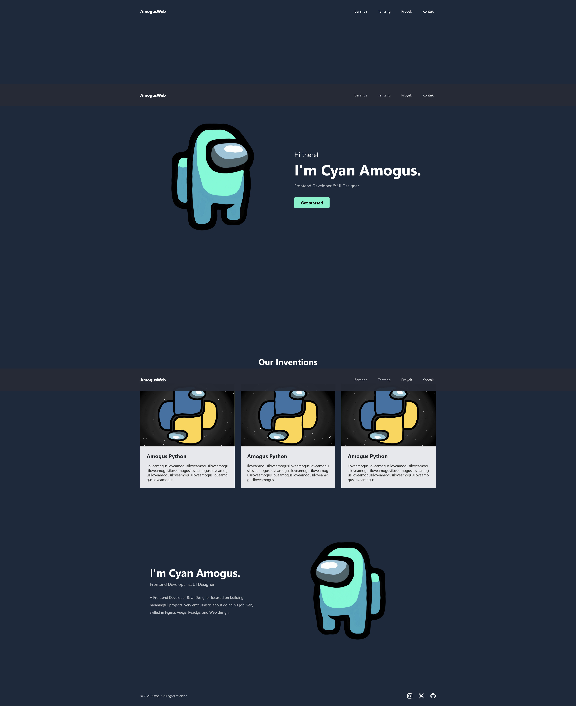
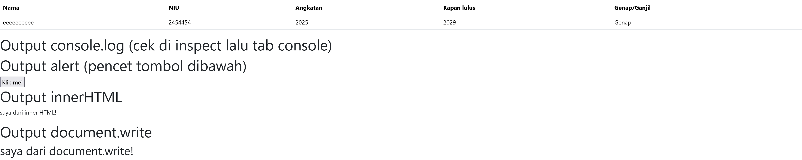
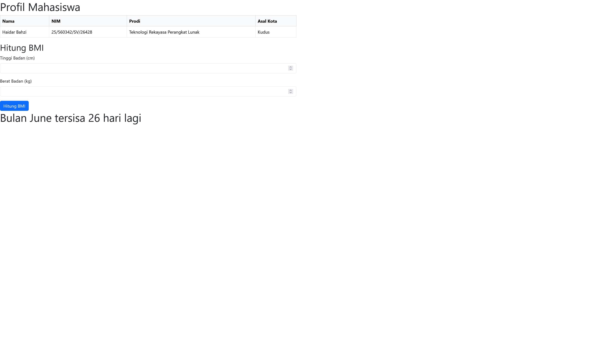
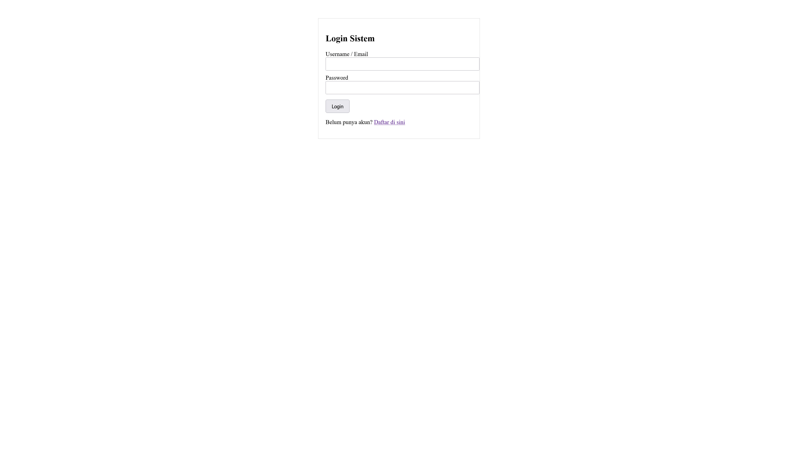

## Nama: Haidar Bahzi
## NIM: 25/560342/SV/26428

| Nomor Bab | Judul Bab | Screenshot |
| --- | --- | --- |
| Bab 2 | Dasar-dasar HTML |  |
| Bab 4 | Form dan Graphic |  |
| Bab 5 | Stylesheet |  |
| Bab 6 | Responsive Web Design |  |
| Bab 7 | Stylesheet Lanjutan |  |
| Bab 8 | Bootstrap |  |
| Bab 9 | Design Website |  |
| Bab 10 | Javascript |  |
| Bab 11 | PHP |  |
| Bab 12 | PHP - CRUD |  |
